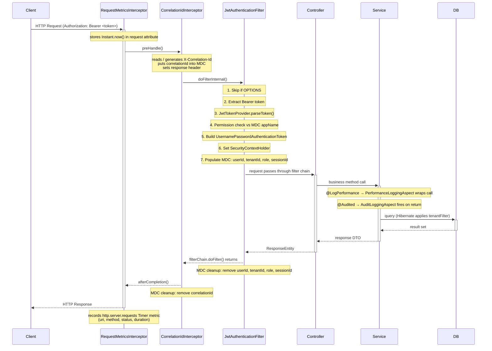
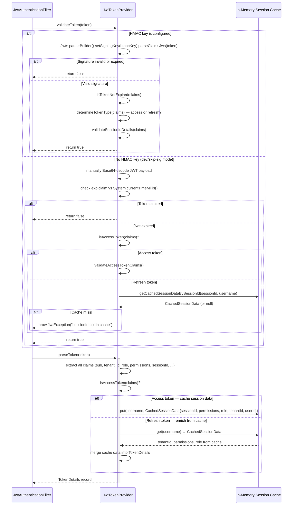
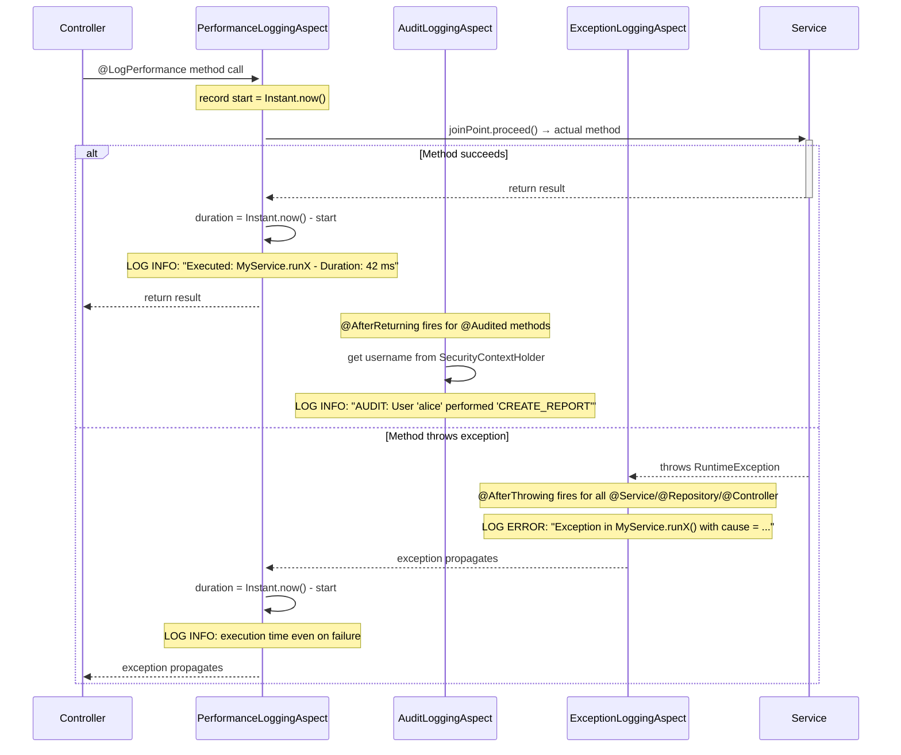
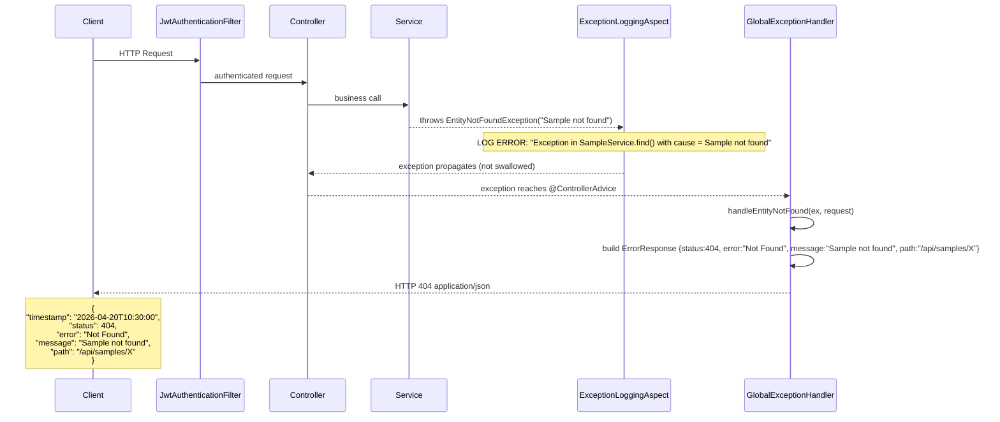

# mgm-linc-common — Technical Overview

> This document is intended for engineers onboarding to any MedGenome microservice that
> consumes this shared library. It describes every major component, its responsibility,
> and how the components interact at runtime.

---

## Table of Contents

1. [What is this library?](#1-what-is-this-library)
2. [Package Structure](#2-package-structure)
3. [Auto-Configuration Bootstrap](#3-auto-configuration-bootstrap)
4. [Security Layer](#4-security-layer)
   - 4.1 [JwtTokenProvider](#41-jwttokenprovider)
   - 4.2 [JwtAuthenticationFilter](#42-jwtauthenticationfilter)
   - 4.3 [SecurityConfig](#43-securityconfig)
   - 4.4 [WebConfig — CORS](#44-webconfig--cors)
5. [HTTP Interceptors](#5-http-interceptors)
   - 5.1 [CorrelationIdInterceptor](#51-correlationidinterceptor)
   - 5.2 [RequestMetricsInterceptor](#52-requestmetricsinterceptor)
   - 5.3 [SecurityTokenInterceptor](#53-securitytokeninterceptor)
6. [AOP Aspects](#6-aop-aspects)
   - 6.1 [PerformanceLoggingAspect](#61-performanceloggingaspect)
   - 6.2 [AuditLoggingAspect](#62-auditloggingaspect)
   - 6.3 [ExceptionLoggingAspect](#63-exceptionloggingaspect)
7. [Global Exception Handler](#7-global-exception-handler)
8. [Multi-Tenancy](#8-multi-tenancy)
9. [Database Configuration](#9-database-configuration)
10. [JPA Auditing](#10-jpa-auditing)
11. [AuthenticationUtils — Helper API](#11-authenticationutils--helper-api)
12. [Configuration Properties Reference](#12-configuration-properties-reference)
13. [Sequence Diagrams](#13-sequence-diagrams)
    - 13.1 [Normal Authenticated Request Flow](#131-normal-authenticated-request-flow)
    - 13.2 [JWT Token Validation Detail](#132-jwt-token-validation-detail)
    - 13.3 [Refresh Token Flow](#133-refresh-token-flow)
    - 13.4 [AOP Aspects at Service Layer](#134-aop-aspects-at-service-layer)
    - 13.5 [Exception Handling Flow](#135-exception-handling-flow)
14. [Consuming via GitHub Packages](#14-consuming-via-github-packages)

---

## 1. What is this library?

`mgm-linc-common` is a **Spring Boot auto-configuration library** (starter) shared across all
MedGenome microservices. Including it as a Maven dependency gives any service:

- Stateless JWT-based authentication with multi-tenant enforcement
- Distributed tracing via Correlation IDs
- Structured request/response metrics (Micrometer)
- AOP-driven audit, performance, and exception logging
- A standardized error response format
- Multi-datasource connection pool management
- Automatic JPA entity auditing (`createdBy`, `updatedAt`, etc.)

Services do **not** generate JWT tokens themselves — token generation is handled by the
central IAM service. This library only **validates and parses** tokens.

---

## 2. Package Structure

```
com.medgenome
├── common
│   ├── CommonLibraryAutoConfiguration.java   ← single bootstrap entry point
│   ├── aop
│   │   ├── annotation
│   │   │   ├── @Audited                       ← marks methods for audit logging
│   │   │   └── @LogPerformance                ← marks methods for perf logging
│   │   ├── AuditLoggingAspect.java
│   │   ├── ExceptionLoggingAspect.java
│   │   └── PerformanceLoggingAspect.java
│   ├── config
│   │   ├── JpaAuditingAutoConfiguration.java
│   │   ├── PriorityConfigurationProperties.java
│   │   └── PriorityPropertySource.java
│   ├── db
│   │   ├── DatabaseConfiguration.java         ← multi-datasource pool setup
│   │   └── DatabaseProperties.java
│   ├── entity
│   │   └── AuditableEntity.java               ← base class for JPA entities
│   ├── http
│   │   ├── exception
│   │   │   ├── GlobalExceptionHandler.java
│   │   │   └── ErrorResponse.java
│   │   └── interceptor
│   │       ├── CorrelationIdInterceptor.java
│   │       ├── RequestMetricsInterceptor.java
│   │       ├── SecurityTokenInterceptor.java
│   │       ├── GlobalInterceptorConfiguration.java
│   │       └── InterceptorProperties.java
│   ├── impl
│   │   ├── RequestContextAuditorAware.java
│   │   └── RequestContextHolder.java
│   └── logging
│       ├── LoggingConfiguration.java
│       ├── RequestLoggingConfiguration.java
│       ├── LoggingProperties.java
│       └── RequestLoggingProperties.java
└── auth
    ├── config
    │   ├── SecurityConfig.java                ← Spring Security filter chain
    │   ├── WebConfig.java                     ← CORS settings
    │   └── MultiTenantAuthProperties.java     ← auth.* config properties
    ├── controller
    │   ├── OtpController.java
    │   ├── SignUpController.java
    │   ├── SsoController.java
    │   ├── TenantMasterController.java
    │   └── VerificationController.java
    ├── dto
    │   ├── TokenDetails.java                  ← parsed JWT claim carrier
    │   ├── CachedSessionData.java             ← in-memory session cache record
    │   ├── AuthRequest / AuthResponse
    │   ├── OtpRequest / OtpVerificationRequest
    │   └── RefreshTokenRequest / SsoLoginRequest
    ├── entity
    │   ├── User, Tenant, TenantMaster
    │   ├── Role, Permission, RoleDomainPermission
    │   ├── RefreshToken, UserOtp, SsoSession
    │   └── Application, Domain, UserRole
    ├── repository  (JPA repositories for all entities above)
    ├── security
    │   ├── JwtTokenProvider.java              ← validates + parses JWT
    │   ├── JwtAuthenticationFilter.java       ← per-request JWT filter
    │   ├── RestAuthenticationEntryPoint.java  ← JSON 401 response
    │   └── MDCLoggingFilter.java
    ├── service
    │   ├── TenantFilterService.java           ← applies Hibernate tenant filter
    │   ├── UserService, SignUpService
    │   ├── OtpService, VerificationService
    │   ├── SsoService, RefIdService
    │   ├── EmailService / EmailServiceImpl / NoOpEmailService
    │   └── SmsService
    └── util
        └── AuthenticationUtils.java           ← static helper for downstream services
```

---

## 3. Auto-Configuration Bootstrap

**File:** `CommonLibraryAutoConfiguration.java`

This is the single `@Configuration` class that activates the entire library. Spring Boot
discovers it automatically via the `META-INF/spring/` service-loader mechanism when the
JAR is on the classpath.

```
@ConditionalOnProperty(name = "common.enabled", havingValue = "true", matchIfMissing = true)
```

This means it activates by default; a service can opt out by setting `common.enabled=false`.

What it wires up:

| Category          | Beans registered                                                                 |
|-------------------|----------------------------------------------------------------------------------|
| Properties        | `LoggingProperties`, `RequestLoggingProperties`, `InterceptorProperties`, `DatabaseProperties`, `MultiTenantAuthProperties` |
| Logging           | `LoggingConfiguration`, `RequestLoggingConfiguration`                           |
| AOP               | `PerformanceLoggingAspect`, `AuditLoggingAspect`, `ExceptionLoggingAspect`      |
| HTTP              | `GlobalInterceptorConfiguration`, `CorrelationIdInterceptor`, `RequestMetricsInterceptor`, `SecurityTokenInterceptor`, `GlobalExceptionHandler` |
| Database          | `DatabaseConfiguration`, `JpaAuditingAutoConfiguration`                         |
| Multi-tenancy     | `TenantFilterService`                                                            |
| Priority props    | `PriorityPropertySource` (registered first in the environment property chain)   |

---

## 4. Security Layer

### 4.1 JwtTokenProvider

**File:** `com.medgenome.auth.security.JwtTokenProvider`

This is the heart of authentication. It never generates tokens — that is the IAM service's
job. It only **validates** and **parses** tokens passed in requests.

#### Key responsibilities

| Responsibility | Details |
|----------------|---------|
| Signature validation | Uses HS256 with `auth.jwt.secret-key`. If no key is configured, signature check is skipped and only expiry is verified. |
| Token type detection | Distinguishes **access tokens** (have `permissions`/`role` claims) from **refresh tokens** (minimal claims + `sessionId`). |
| Session ID enforcement | Validates that every refresh token carries the same `sessionId` as the original access token, preventing session hijacking. |
| In-memory session cache | A `ConcurrentHashMap<username, CachedSessionData>` stores `sessionId`, `permissions`, `role`, `tenantId`, and `userId` extracted from access tokens so refresh tokens can be enriched. |
| qcstats relaxation | Tokens issued by the `qcstats` issuer bypass strict sessionId checks. |

#### Token claims expected

```
Access Token claims:
  sub          → username
  tenant_id    → tenant ID (integer)
  user_id      → user ID (integer)
  role         → single role string
  permissions  → list of permission strings
  sessionId    → session identifier
  type         → "access"
  iat, exp     → issued-at, expiry (epoch seconds)

Refresh Token claims:
  sub          → username
  sessionId    → must match the cached access token sessionId
  type         → "refresh"
  iat, exp
```

### 4.2 JwtAuthenticationFilter

**File:** `com.medgenome.auth.security.JwtAuthenticationFilter`

A `OncePerRequestFilter` — it runs exactly once per HTTP request before any controller
or service code executes.

#### Processing steps

1. Skip OPTIONS requests (CORS preflight — no token needed).
2. Extract `Bearer <token>` from the `Authorization` header.
3. Call `JwtTokenProvider.parseToken()` to obtain a `TokenDetails` record.
4. Check **application-level permission**: the MDC value `appName` must appear as a
   prefix in at least one of the token's `permissions`. If not, return HTTP 403.
   - Exception: user `BFXPipeline` bypasses this check.
5. Build a `UsernamePasswordAuthenticationToken` with all permissions as
   `SimpleGrantedAuthority` entries and set it in `SecurityContextHolder`.
6. Store `tenantId` in `authentication.getDetails()` (Integer) for backward
   compatibility with legacy services.
7. Store the full `TokenDetails` object in `request.setAttribute("tokenDetails", ...)`.
8. Populate MDC with `userId`, `tenantId`, `role`, `sessionId` for structured logging.
9. On any parse failure → HTTP 401. Clean up MDC in `finally`.

### 4.3 SecurityConfig

**File:** `com.medgenome.auth.config.SecurityConfig`

Configures the Spring Security filter chain:

```
- CSRF:        disabled (stateless API)
- Form login:  disabled
- HTTP Basic:  disabled
- Sessions:    STATELESS
- Public URLs: /api/auth/**, /actuator/**, OPTIONS /**
- All others:  authenticated
- Entry point: RestAuthenticationEntryPoint → JSON { status: 401, message: ... }
- Filter:      JwtAuthenticationFilter before UsernamePasswordAuthenticationFilter
- Password:    BCryptPasswordEncoder
```

### 4.4 WebConfig — CORS

**File:** `com.medgenome.auth.config.WebConfig`

Allows all origins, all standard HTTP methods, and all headers for every path (`/**`)
with a 1-hour preflight cache. This is intentionally permissive; tighten in production
environments if needed.

---

## 5. HTTP Interceptors

All interceptors implement Spring MVC's `HandlerInterceptor` and are registered by
`GlobalInterceptorConfiguration`. Each is independently toggleable.

### 5.1 CorrelationIdInterceptor

**Property:** `common.interceptor.correlation-id-enabled` (default: `true`)  
**Order:** `HIGHEST_PRECEDENCE + 10` (runs very early, after metrics interceptor)

- Reads the correlation ID from the incoming request header (configurable name,
  default `X-Correlation-Id`).
- If absent and `generateCorrelationIdIfMissing=true`, generates a new `UUID`.
- Writes the ID to MDC (`correlationId`) so every log line in the request includes it.
- Echoes it back in the response header.
- Removes MDC key in `afterCompletion`.

### 5.2 RequestMetricsInterceptor

**Property:** `common.interceptor.metrics-enabled` (default: `true`)  
**Order:** `HIGHEST_PRECEDENCE` (runs first of all interceptors)  
**Requires:** Micrometer `MeterRegistry` on classpath (auto-excluded if absent)

- Stores `Instant.now()` in a request attribute at `preHandle`.
- In `afterCompletion`, records the elapsed milliseconds into a Micrometer
  `Timer` metric named `http.server.requests` tagged with `uri`, `method`, `status`,
  and `exception`.

### 5.3 SecurityTokenInterceptor

**Property:** `common.interceptor.security-token-enabled` (default: `false`)  
**Order:** `HIGHEST_PRECEDENCE + 20`

An optional secondary token validation layer that sits at the interceptor level (before
controllers). Uses `JwtTokenProvider.validateToken()`. Excluded paths are configurable.
Disabled by default since `JwtAuthenticationFilter` already covers token validation —
enable only when an extra interception point is needed.

---

## 6. AOP Aspects

All three aspects are annotation- or pointcut-driven and are activated by default. They
can be individually disabled via properties.

### 6.1 PerformanceLoggingAspect

**Property:** `common.aop.performance.enabled` (default: `true`)  
**Trigger:** `@LogPerformance` on any method

Wraps the method using `@Around` advice. Logs the class name, method name, argument
values, and execution duration in milliseconds at `INFO` level.

**Usage in downstream services:**
```java
@LogPerformance
public SampleResult runAnalysis(String sampleId) { ... }
```

### 6.2 AuditLoggingAspect

**Property:** `common.aop.audit.enabled` (default: `true`)  
**Trigger:** `@Audited(action = "CREATE_REPORT")` on any method

Uses `@AfterReturning` — fires only when the method returns successfully. Logs the
authenticated username, the declared action name, and the timestamp. Designed to be
extended to persist audit events to a database or send to an external audit system.

**Usage in downstream services:**
```java
@Audited(action = "UPLOAD_SAMPLE")
public void uploadSample(SampleDTO dto) { ... }
```

### 6.3 ExceptionLoggingAspect

**Property:** `common.aop.exception.enabled` (default: `true`)  
**Trigger:** Any exception thrown from a `@Service`, `@Repository`, `@Controller`,
or `@RestController` class

Uses `@AfterThrowing`. Logs the declaring class, method name, and exception message at
`ERROR` level. For checked exceptions (non-`RuntimeException`), also logs the full stack
trace. Does not swallow the exception — it propagates normally.

---

## 7. Global Exception Handler

**File:** `com.medgenome.common.http.exception.GlobalExceptionHandler`

A `@ControllerAdvice` that intercepts exceptions escaping any controller and converts
them to a uniform `ErrorResponse` JSON structure:

```json
{
  "timestamp": "2026-04-20T10:30:00",
  "status": 400,
  "error": "Bad Request",
  "message": "Validation failed",
  "path": "/api/samples",
  "validationErrors": {
    "sampleId": "must not be blank"
  }
}
```

| Exception type                                   | HTTP status | Notes                                       |
|--------------------------------------------------|-------------|---------------------------------------------|
| `EntityNotFoundException`                        | 404         | Message passed through to client            |
| `DataAccessException`                            | 500         | Generic message — DB details hidden         |
| `MethodArgumentNotValidException` / `BindException` | 400      | Per-field validation errors in `validationErrors` |
| `ConstraintViolationException`                   | 400         | Bean Validation violations                  |
| Everything else (`Exception`)                    | 500         | Generic "unexpected error" message          |

**Property:** `common.exception.handler-enabled` (default: `true`)

---

## 8. Multi-Tenancy

**File:** `com.medgenome.auth.service.TenantFilterService`

Enables row-level data isolation per tenant using Hibernate's named filter mechanism.

When a service calls `applyTenantFilter()`, the method:
1. Reads the current `Authentication` from `SecurityContextHolder`.
2. Extracts `tenantId` from the authentication details (supports `TokenDetails`,
   `AuthRequest`, raw `Integer`, and raw `String` for backward compatibility).
3. Calls `session.enableFilter("tenantFilter").setParameter("tenantId", tenantId)` on
   the current Hibernate `Session`.

Downstream entity classes must declare the filter:
```java
@FilterDef(name = "tenantFilter", parameters = @ParamDef(name = "tenantId", type = String.class))
@Filter(name = "tenantFilter", condition = "tenant_id = :tenantId")
@Entity
public class Sample extends AuditableEntity { ... }
```

---

## 9. Database Configuration

**File:** `com.medgenome.common.db.DatabaseConfiguration`  
**Property:** `common.db.enabled` (default: `true`)

Supports **multiple named datasources** in a single service. Each datasource is backed by
an **Apache Tomcat JDBC** connection pool. Configuration:

```yaml
common:
  db:
    primary-datasource: linc_db        # which datasource becomes @Primary
    datasources:
      linc_db:
        jdbc-url: jdbc:mysql://host/linc
        username: user
        password: secret
        driver-class-name: com.mysql.cj.jdbc.Driver
        max-pool-size: 20
        min-idle: 5
        connection-timeout-ms: 30000
        idle-timeout-ms: 600000
        max-lifetime-ms: 1800000
      reporting_db:
        jdbc-url: jdbc:mysql://host/reports
        ...
```

Exposed beans:
- `DataSource primaryDataSource` — `@Primary`, used by Spring Data JPA by default.
- `Map<String, DataSource> allDataSources` — inject this to access non-primary sources.
- `JdbcTemplate jdbcTemplate` — wired to the primary datasource.

Pool defaults applied to every datasource:
- `testOnBorrow=true` with `SELECT 1` validation
- `removeAbandoned=true` (timeout: 300 s)
- `JdbcInterceptors: ConnectionState; StatementFinalizer`

---

## 10. JPA Auditing

**File:** `com.medgenome.common.entity.AuditableEntity`

Abstract base class for all JPA entities that need audit trails. Extend it to get four
columns populated automatically:

| Column       | Populated by                                   | When              |
|--------------|------------------------------------------------|-------------------|
| `created_at` | Spring Data `@CreatedDate`                     | INSERT only       |
| `created_by` | `RequestContextAuditorAware` → current username | INSERT only      |
| `updated_at` | Spring Data `@LastModifiedDate`                | INSERT + UPDATE   |
| `updated_by` | `RequestContextAuditorAware` → current username | INSERT + UPDATE  |

`RequestContextAuditorAware` reads the principal name from `SecurityContextHolder`.
If no authentication is present, falls back to `"system"`.

---

## 11. AuthenticationUtils — Helper API

**File:** `com.medgenome.auth.util.AuthenticationUtils`

A **static utility class** — no injection needed. Provides a single stable API for
downstream service code to read auth data from the current request, regardless of
which legacy or new authentication detail type is in use.

| Method | Returns | Notes |
|--------|---------|-------|
| `getTenantId()` | `String` | Reads from current SecurityContext |
| `getTenantIdAsInteger()` | `Integer` | Parses the String tenant ID |
| `getUsername()` | `String` | `authentication.getName()` |
| `getTokenDetails()` | `TokenDetails` | First checks request attribute `tokenDetails`, then falls back to auth details |

All methods return `null` when no authentication is present (unauthenticated context).

---

## 12. Configuration Properties Reference

```yaml
common:
  enabled: true                          # master switch for the entire library

  interceptor:
    correlation-id-enabled: true
    correlation-id-header-name: X-Correlation-Id
    generate-correlation-id-if-missing: true
    metrics-enabled: true
    security-token-enabled: false        # secondary interceptor-level token check
    security-token-header-name: Authorization
    security-token-prefix: "Bearer "
    security-token-excluded-path-patterns: []

  aop:
    performance.enabled: true
    audit.enabled: true
    exception.enabled: true

  exception:
    handler-enabled: true

  db:
    enabled: true
    primary-datasource: <name>
    datasources:
      <name>:
        jdbc-url:
        username:
        password:
        driver-class-name:
        max-pool-size: 10
        min-idle: 2
        connection-timeout-ms: 30000
        idle-timeout-ms: 600000
        max-lifetime-ms: 1800000

auth:
  jwt:
    secret-key: ""                        # leave empty to skip signature validation
    validate-session-id: true
    access-token-validity-minutes: 15
    refresh-token-validity-hours: 8
    issuer: multi-tenant-auth
  otp:
    length: 6
    validity-minutes: 5
    email-template: "Your OTP is: {0}. Valid for {1} minutes."
    sms-template: "Your OTP is: {0}. Valid for {1} minutes."
  mail:
    from: noreply@medgenome.com
    subject: "Your OTP Code"
  twilio:
    account-sid:
    auth-token:
    from-number:
```

---

## 13. Sequence Diagrams

### 13.1 Normal Authenticated Request Flow

Shows the full lifecycle of a protected API call from client to controller and back.



---

### 13.2 JWT Token Validation Detail

Zooms into what `JwtTokenProvider.validateToken()` and `parseToken()` do internally.



---

### 13.3 Refresh Token Flow

Shows how a client exchanges a refresh token for a new access token and how the library
enforces sessionId continuity.

```mermaid
sequenceDiagram
    participant Client
    participant IAM as IAM Service (external)
    participant Filter as JwtAuthenticationFilter
    participant Provider as JwtTokenProvider
    participant Cache as Session Cache

    Note over Client,IAM: Step 1 — Initial Login (IAM generates both tokens)
    Client->>IAM: POST /api/auth/login {username, password, tenantId}
    IAM-->>Client: { accessToken, refreshToken }

    Note over Client,Filter: Step 2 — First API call with Access Token
    Client->>Filter: GET /api/resource  Authorization: Bearer <accessToken>
    Filter->>Provider: parseToken(accessToken)
    Provider->>Provider: extract claims: sessionId=S1, tenantId=T1, permissions=[...]
    Provider->>Cache: put(username → {S1, permissions, role, T1, userId})
    Provider-->>Filter: TokenDetails(username, T1, role, permissions, S1)
    Filter-->>Client: 200 OK

    Note over Client,Provider: Step 3 — Access Token Expires; use Refresh Token
    Client->>Filter: POST /api/auth/refresh  Authorization: Bearer <refreshToken>
    Filter->>Provider: parseToken(refreshToken)
    Provider->>Provider: extract claims: sub=username, sessionId=S1
    Provider->>Cache: getCachedSessionDataBySessionId(S1, username)
    Cache-->>Provider: {S1, permissions, role, T1, userId}
    Provider->>Provider: validate S1 matches cached S1 ✓
    Provider->>Provider: enrich TokenDetails with tenantId, permissions from cache
    Provider-->>Filter: TokenDetails(username, T1, role, permissions, S1)
    Filter-->>IAM: forward to token refresh endpoint
    IAM-->>Client: { newAccessToken, newRefreshToken } (same sessionId S1)

    Note over Client,Provider: Step 4 — Attempt with tampered sessionId (REJECTED)
    Client->>Filter: Request with manipulated refreshToken (sessionId=S2)
    Filter->>Provider: parseToken(refreshToken)
    Provider->>Cache: getCachedSessionDataBySessionId(S2, username)
    Cache-->>Provider: null (S2 not found)
    Provider-->>Filter: throw JwtException("sessionId not found in cache")
    Filter-->>Client: 401 Unauthorized
```

---

### 13.4 AOP Aspects at Service Layer

Shows how the three AOP aspects wrap service method execution.



---

### 13.5 Exception Handling Flow

Shows what happens when an exception escapes a controller and how it is converted to a
standardized JSON response.



---

## 14. Consuming via GitHub Packages

This library is published to **GitHub Packages** as:

`io.linc:multi-tenant-jwt-auth-starter`

Package URL: `https://maven.pkg.github.com/Clairlabs-AI/io-linc-common`

Pushes to `main` / `development` and tags matching `v*` run
[`.github/workflows/publish.yml`](../.github/workflows/publish.yml) and deploy the JAR.

### 14.1 Consumer `pom.xml`

```xml
<repositories>
  <repository>
    <id>github</id>
    <url>https://maven.pkg.github.com/Clairlabs-AI/io-linc-common</url>
    <snapshots>
      <enabled>true</enabled>
    </snapshots>
  </repository>
</repositories>

<dependency>
  <groupId>io.linc</groupId>
  <artifactId>multi-tenant-jwt-auth-starter</artifactId>
  <version>1.1.1-SNAPSHOT</version>
</dependency>
```

The repository `<id>` must be `github` so it matches the server credentials in `settings.xml`.

### 14.2 Local Maven settings

Use the template at [`docs/maven-settings.xml.example`](maven-settings.xml.example):

1. Copy it (e.g. to `~/.m2/settings.xml` or pass `-s path/to/settings.xml`).
2. Set your GitHub username and a PAT with `read:packages`.
3. Run `mvn -s path/to/settings.xml clean package`.

### 14.3 Consumer GitHub Actions

Before `mvn …` in a consumer workflow, write settings that authenticate with the org secret
`IO_LINC_COMMON_PACKAGE_TOKEN` (PAT with `read:packages`; include `write:packages` only for publishers).
Ensure the consumer repository is allowed to use that org secret.

```yaml
permissions:
  contents: read
  packages: read

jobs:
  build:
    runs-on: ubuntu-latest
    steps:
      - uses: actions/checkout@v4

      - uses: actions/setup-java@v4
        with:
          java-version: '17'
          distribution: 'temurin'
          cache: maven

      - name: Write Maven settings for GitHub Packages
        run: |
          mkdir -p "$HOME/.m2"
          cat > "$HOME/.m2/settings.xml" << EOF
          <settings xmlns="http://maven.apache.org/SETTINGS/1.0.0"
                    xmlns:xsi="http://www.w3.org/2001/XMLSchema-instance"
                    xsi:schemaLocation="http://maven.apache.org/SETTINGS/1.0.0 https://maven.apache.org/xsd/settings-1.0.0.xsd">
            <servers>
              <server>
                <id>github</id>
                <username>x-access-token</username>
                <password>${{ secrets.IO_LINC_COMMON_PACKAGE_TOKEN }}</password>
              </server>
            </servers>
          </settings>
          EOF

      - name: Build
        run: mvn -B clean package
```

### 14.4 Package visibility (one-time after first publish)

After the first successful deploy from this repo:

1. Open **GitHub → Clairlabs-AI → Packages → multi-tenant-jwt-auth-starter**.
2. Grant download access to the org or to each consumer repository.
3. Confirm a consumer workflow can resolve the dependency without 401/403.

Without this step, POM + settings alone will still fail in CI.

### 14.5 Versioning

- `*-SNAPSHOT` builds publish from `development` / `main` for day-to-day shared work.
- For stable pins, bump to a release version (e.g. `1.1.1`), tag `v1.1.1`, and depend on that version in production consumers.

---

*Document generated from source at `mgm-linc-common` — branch `Development`.*
